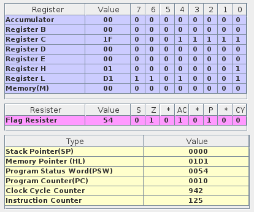
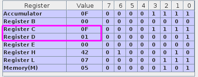
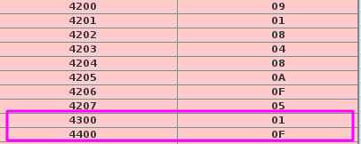

# Assignment 1

## Question 1

### Objective

Find out the sum of the **first 30 natural numbers**.

### Tool / Experimental setup considered

- Used [Jubin’s 8085 Simulator](https://github.com/8085simulator/8085simulator.github.io).

### Procedure

The sum of first 30 natural numbers is `435` i.e `0x01D1`. Since the value is greater than `256` we need two register pair to store the value.

### Program

```asm
	   LXI H,0000	; Load H-L pair with 0000H, it will be used as an accumulator
	   MVI D,1E	; Move immediate data to register, D storing 0x1E = 30
	   MVI C,01	; B-C pair storing 00-01

L1:	   DAD B	; Double ADd
	   INX B	; INcrementeXtended register, increments B-C
	   DCR D	; DeCRement, decrements D
	   JNZ L1	; Jump Not Zero
	   SHLD 8085	; Store HLpair using Direct addressing, storing the data in 8085
	   HLT	; Halt
```

### Experimentation



### Conclusion

Finally the data stored in HL register pair is `0x01D1` i.e `435`. This is the sum of first 30 natural numbers.**Hence the program is working as expected.**

<hr>

## Question 2

### Objective

From an array of 10-byte size integers (unsigned) find out the maximum and minimum.

### Tool / Experimental setup considered

- Used [Jubin’s 8085 Simulator](https://github.com/8085simulator/8085simulator.github.io).

### Procedure

Loop through the entire array of integers, and store the maximum and minimum values in the registers.

### Program

```asm
# ORG 4200H
# ARR: DB 9, 1, 8, 4, 8, A, F, 5
# LEN EQU 08
# ORG 0000H
	LXI H,ARR
	MVI B,LEN ; number of elements
	MOV D,M	 ; storing the min in D
	MOV C,M	 ; storing the max in C
	DCR B

LOOP:
	INX H
	MOV A,M
	CMP D
	JNC MAX
	MOV D,M

MAX:
	CMP C
	JC AHEAD
	MOV C,A

AHEAD:
	DCR B
	JNZ LOOP
	MOV A,D
	STA 4300
	MOV A,C
	STA 4400
	HLT
```

### Experimentation




### Conclusion

After the execution the maximum value is stored in register C and the minimum in register D.

## Question 3

### Objective

Write a routine that produces a delay. The delay value must be passed to register pair DE.

### Tool / Experimental setup considered

- Used [Jubin’s 8085 Simulator](https://github.com/8085simulator/8085simulator.github.io).

### Procedure

We can simulate the delay by running a long loop. The loop will be executed for the number of times specified in DE register pair.

### Program

```asm
      LXI D, E000H
      CALL DELAY
      HLT
DELAY: DCX D
      MOV A, D
      ORA E
      JNZ DELAY
      RET
```

### Conclusion

Will notice the code runs for sometime and the value of DE register pair is decremented. Hence the delay is produced.
