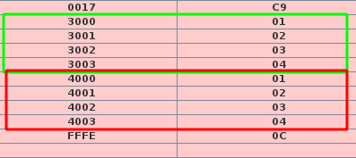
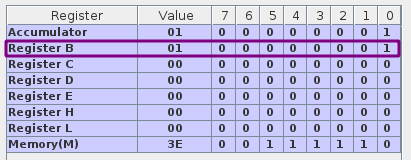
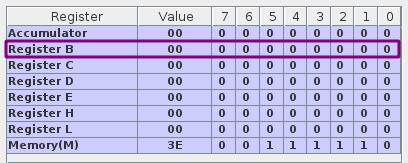
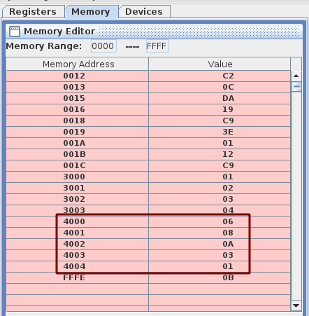

- [Assignment 2](#assignment-2)
  - [Question 1](#question-1)
    - [Objective](#objective)
    - [Tool / Experimental setup considered](#tool--experimental-setup-considered)
    - [Procedure](#procedure)
    - [Program](#program)
    - [Experimentation](#experimentation)
    - [Conclusion](#conclusion)
  - [Question 2](#question-2)
    - [Objective](#objective-1)
    - [Tool / Experimental setup considered](#tool--experimental-setup-considered-1)
    - [Procedure](#procedure-1)
    - [Program](#program-1)
    - [Experimentation](#experimentation-1)
    - [Conclusion](#conclusion-1)
  - [Question 3](#question-3)
    - [Objective](#objective-2)
    - [Tool / Experimental setup considered](#tool--experimental-setup-considered-2)
    - [Procedure](#procedure-2)
    - [Program](#program-2)
    - [Experimentation](#experimentation-2)
    - [Conclusion](#conclusion-2)

# Assignment 2

## Question 1

### Objective

Write a subroutine to move a block of bytes from location X to location Y. Note that the caller would specify X and Y; the source and destination along with the block size, say, Z. X, Y and Z are 16-bit quantities.

### Tool / Experimental setup considered

- Used [Jubin’s 8085 Simulator](https://github.com/8085simulator/8085simulator.github.io).

### Procedure

For this program, I am

- Storing Z in B-C
- Storing X in D-E
- Storing Y in H-L

Now, we will start reading from X and writing to Y, Z times and the entire block will be copied.

### Program

```asm
; Storing Z in B-C
; Storing X in D-E
; Storing Y in H-L

# ORG 3000H
# ARR: DB 1, 2, 3, 4

# ORG 0000H
LXI B, 0004 ; count
LXI D, 3000 ; source
LXI H, 4000 ; destination
CALL MOVE
HLT

; Moving 4 bytes from 3000 -> 4000

MOVE:
  LDAX D  ; Stores the content of D-E in A
  MOV M, A ; M -> HL
  INX H
  INX D
  DCX B
  MOV A, B
  ORA C
  JNZ MOVE
  RET
```

### Experimentation



### Conclusion

We can see that values from `4000` to `4004` is copied from `3000` to `3004`. Here Z is `4`, X is `3000`, and Y is `4000`. Hence, the block of bytes is copied.

<hr>

## Question 2

### Objective

Write a function isODD(unsigned n) in assembly that takes an unsigned integer (a byte) and determines if it is odd (returns 1) or 0 if it is even.

### Tool / Experimental setup considered

- Used [Jubin’s 8085 Simulator](https://github.com/8085simulator/8085simulator.github.io).

### Procedure

Odd numbers always have their 0-th bit set. So, we can use the AND instruction to check if the 0-th bit is set.

### Program

```asm
# NUM EQU 7
MVI A, NUM
CALL ISODD
HLT

// Will store 1 in register B if odd, else 0.
ISODD:
  ANI 01    ; AND Immediate with the data and store the result in Acc
  MOV B,A
  RET

```

### Experimentation

When the `NUM` is 7 (Odd).



When the `NUM` is 8 (Even).


### Conclusion

In case the `NUM` was odd, the register C was set. And, when the `NUM` was even, the register C was not set. Hence, the function returns 1 if the `NUM` was odd and 0 if the `NUM` was even.

<hr>

## Question 3

### Objective

Write a function to add two multi-byte numbers stored in location X and Y. The result is stored in X. Pass a parameter Z indicating the no. of bytes to be added.

### Tool / Experimental setup considered

- Used [Jubin’s 8085 Simulator](https://github.com/8085simulator/8085simulator.github.io).

### Procedure

Looped through the no. of bytes to be added. Each time we add the content of X and Y and store the result in X. For that we use the `ADC` which adds the content along with the carry. Finally, we check if there is a carry and if yes, we add 1 to the result.

> **Note:** Here we are assuming the numbers are written in Little-Endian format i.e the most significant bit is stored in the largest address.

### Program

```asm
# ORG 3000h
# ARR: DB 01,02,03,04

# ORG 4000h
# ARR: DB 05,06,07,FF

# LEN EQU 04

# ORG 0000h
LXI H,3000H ; Y
LXI D,4000H ; X
MVI B, LEN  ; Z
CALL SUM
HLT

SUM:
  LDAX D ;copies the contents of that memory location D-E into the accumulator
  ADC M  ;ADd with Carry
  STAX D ;contents of the A are copied into the memory location
  INX D
  INX H
  DCR B
  JNZ SUM
  JC CARRY ;If there is some left out carry
  RET

CARRY:
  MVI A, 01h
  STAX D
  RET

```

### Experimentation

Adding `01,02,03,04` and `05,06,07,FF`


### Conclusion

Result of adding `01,02,03,04` and `05,06,07,FF` is `06,08,0A,03,01` and that is exactly what we got. Hence, the function returns the correct result.
