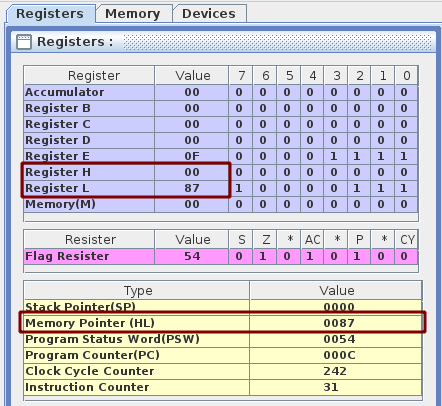
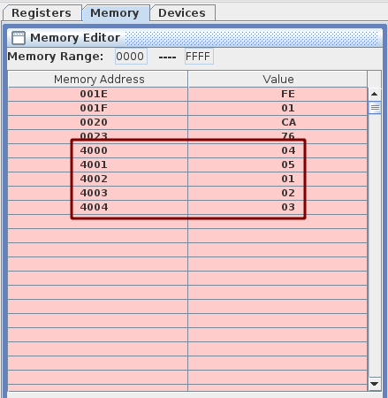
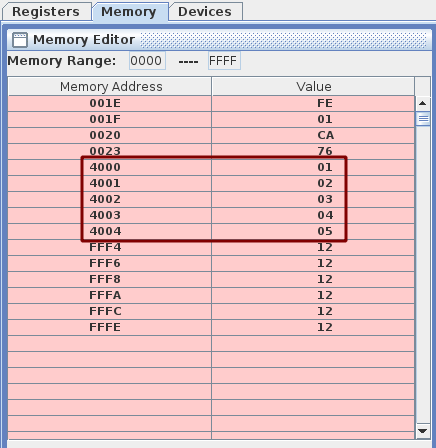
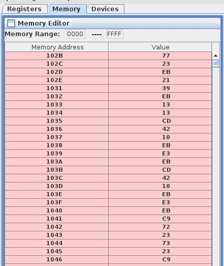

- [Assignment 3](#assignment-3)
  - [Question 1](#question-1)
    - [Objective](#objective)
    - [Tool / Experimental setup considered](#tool--experimental-setup-considered)
    - [Procedure](#procedure)
    - [Program](#program)
    - [Experimentation](#experimentation)
    - [Conclusion](#conclusion)
  - [Question 2](#question-2)
    - [Objective](#objective-1)
    - [Tool / Experimental setup considered](#tool--experimental-setup-considered-1)
    - [Procedure](#procedure-1)
    - [Program](#program-1)
    - [Experimentation](#experimentation-1)
    - [Conclusion](#conclusion-1)
  - [Question 3](#question-3)
    - [Objective](#objective-2)
    - [Tool / Experimental setup considered](#tool--experimental-setup-considered-2)
    - [Program](#program-2)
    - [Experimentation](#experimentation-2)
    - [Conclusion](#conclusion-2)

# Assignment 3

## Question 1

### Objective

Write a fast sub-routine to multiply 9 by 15.

### Tool / Experimental setup considered

- Used [Jubin’s 8085 Simulator](https://github.com/8085simulator/8085simulator.github.io).

### Procedure

We can add 15, 9 times to get 9*15 because multiplication is nothing but repeated addition.

### Program

```asm
LXI H,0000H
MVI E,0FH
MVI B,09H
LOOP:
  DAD D ; HL <- HL + DE
  DCR B ; Decrease B (1-byte)
  JNZ LOOP
HLT
```

### Experimentation



### Conclusion

9*15 = 135 which in hex is `0x87`. Above we can see that the value in the H-L pair is `0087h`. Hence, our program was able to calculate 9 times 15.

<hr>

## Question 2

### Objective

Write a subroutine to sort a 5-element byte array (Any algorithm will do).

### Tool / Experimental setup considered

- Used [Jubin’s 8085 Simulator](https://github.com/8085simulator/8085simulator.github.io).

### Procedure

Performing a simple bubble sort, where we  compare adjacent elements and swaps them if they are in the wrong order. The pass through the list is repeated until the list is sorted.

### Program

```asm
# ORG 4000h
# ARR: DB 04,05,01,02,03
# LEN EQU 5

# ORG 0000h

MAIN:
  LXI H,ARR
  MVI D,00
  MOV C,LEN
  DCR C
CHECK:
  MOV A,M
  INX H
  CMP M
  JC NEXT
  JZ NEXT
  CALL SWAP
SWAP:
  MOV B,M
  MOV M,A
  DCX H
  MOV M,B
  INX H
  MVI D,01

NEXT:
  DCR C
  JNZ CHECK
  MOV A,D
  CPI 01
  JZ MAIN
  HLT
```

### Experimentation

Before sorting (just assembling the code)



After sorting



### Conclusion

Finally we can see in the memory range `4000` to `4004` that the numbers are all sorted, hence our code worked.

<hr>

## Question 3

### Objective

Write a sub-routine to STORE all the registers (`A`, `F`, `B`, `C`, `D`, `E`, `H`, `L`, `I`, `SPL`, `SPH`, `PCL`, `PC`, in that order) starting from location `MYREGISTERS`.

### Tool / Experimental setup considered

- Used [Jubin’s 8085 Simulator](https://github.com/8085simulator/8085simulator.github.io).

### Program

```asm
# ORG 1000H
# MYREG EQU 2000H
       MVI A,10
       LXI B,1001
       LXI D,2002
       LXI H,3003
       SIM
       LXI SP,F001h
       CALL MAIN
       HLT

MAIN:
  PUSH H
  PUSH D
  PUSH B
  PUSH PSW
  LXI H,MYREG
  POP D
  CALL STORE
  POP D
  CALL STORE
  POP D
  CALL STORE
  POP D
  CALL STORE
  RIM
  MOV M,A
  INX H
  XCHG
  LXI H,0000
  DAD SP
  XCHG
  INX D
  INX D
  CALL STORE
  XCHG
  XTHL
  XCHG
  CALL STORE
  XCHG
  XTHL
  XCHG
  RET

STORE:
  MOV M,D
  INX H
  MOV M,E
  INX H
  RET
```

### Experimentation



### Conclusion

It is storing all the registers in that order mentioned in the question.

<hr>
