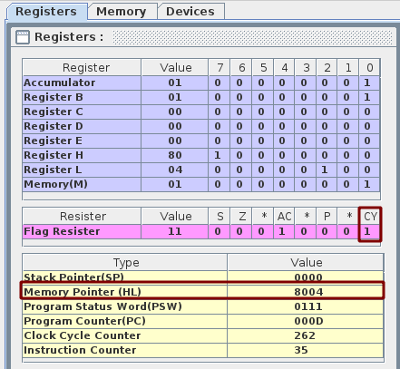
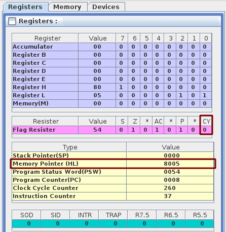
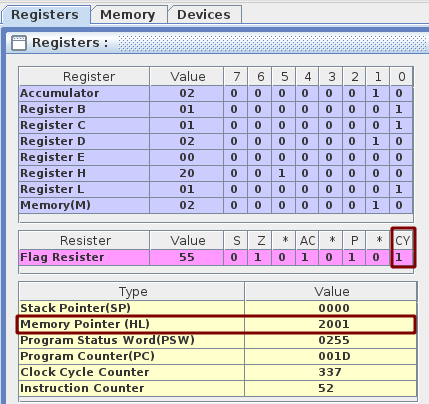
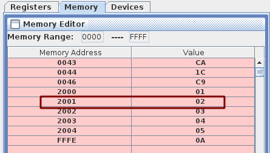
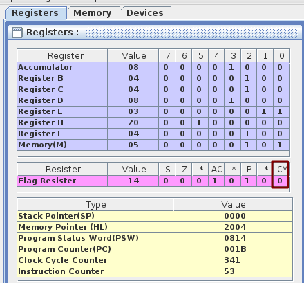

# Assignment 4

## Question 1

### Objective

Implement a POST or power-on-self-test  where each RAM location is tested for stuck-at-zero or stuck-at-one fault. In your case the function takes the start address of the RAM block and the block size in bytes. The function sets CY in case of any error (else it is set to 0); HL contains the faulty location and Acc contains 0 for stuck at zero fault and 1 for stuck at one fault.

>[Note: usually there wont be any error as your RAM is not faulty -- so direct checking may not set CY flag.]

### Tool / Experimental setup considered

- Used [Jubin’s 8085 Simulator](https://github.com/8085simulator/8085simulator.github.io).

### Procedure

We iterate through the block of memory and check if the value is 1. Once we get 1 we exit setting the C flag.

### Program

```asm
// Assuming 8004 is faulty
LXI H,8004
MVI M,01
// Checking from 805 till 5 bytes
LXI H,8000
MVI B,05
CALL CHECK
HLT

CHECK:
    MOV A,M
    ANI 01       // Doing ANDImmediate with 01
    JNZ FAULTY   // If Z is set
    INX H
    DCR B
    JNZ CHECK
    CMC
    STC
    RET

FAULTY:
    STC    // set Cy 1
    RET

```

### Experimentation

Assuming that `8004` is faulty.


When nothing is faulty.


### Conclusion

We can see that the memory pointer is at `8004` and the C flag is `1` hence it suggests that the memory address `8004` is faulty.
In the second scenario, where we had no faulty, we can see that C flag remains `0`.

Hence, our code is working properly.

<hr>

## Question 2

### Objective

Implement a binary search --- the function would take the start address and no. of elements in the array. If successful the function resets CY flag and the HL pair points to the element found else CY is set and the value in HL pair is irrelevant.

### Tool / Experimental setup considered

- Used [Jubin’s 8085 Simulator](https://github.com/8085simulator/8085simulator.github.io).

### Procedure

We keep two pointers, one low(Register `B`) and another high(Register `C`). We will check if the mid of this two pointer is the value we are looking for. If we found the value then we set the `CY` flag and break, else we keep the `CY` flag unset.

> **NOTE:** We are assuming that the array is sorted

### Program

```asm
# ORG 2000H
# ARR : DB 1,2,3,4,5
# ORG 0000H
# N EQU 5
# X EQU 2

MVI C, N
DCR C
MVI B,00
MVI D, X
CALL SEARCH
LXI H,ARR
ADD L
MOV L,A
JNC NAD
INR H


NAD:
  MOV A,D
  CMP M
  JZ END
  JC END
  HLT

END:
  CMC
  HLT

SEARCH:
  MOV A,B
  CMP C
  RNC
  ADD C
  JNC NOCARRY
  CMC

NOCARRY:
  RAR
  MOV E,A
  LXI H,ARR
  ADD L
  MOV L,A
  JNC NOTFOUND
  INR H

NOTFOUND:
  MOV A,D
  CMP M
  JC LEFT
  JZ END
  MOV B,E
  INR B
  JMP SEARCH

LEFT:
  MOV C,E
  DCR C
  JNZ SEARCH
  JZ END
  RET
```

### Experimentation

When the array is `{1, 2, 3, 4, 5}` and we are looking for `2`.



When the array is `{1, 2, 3, 4, 5}` and we are looking for `8`.


### Conclusion

Clearly, when the element is found in the array the `CY` flag was set, and the address pointed by the memory pointer was the value we are looking for. On the other hand when the element is not there in the array we see that the `CY` flag remains unset. Hence, our program is working as expected.
