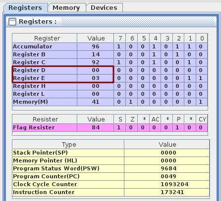

- [Assignment 5](#assignment-5)
  - [Question 1](#question-1)
    - [Objective](#objective)
    - [Tool / Experimental setup considered](#tool--experimental-setup-considered)
    - [Procedure](#procedure)
    - [Program](#program)
    - [Experimentation](#experimentation)
    - [Conclusion](#conclusion)

# Assignment 5

## Question 1

### Objective

Using auto vectored input RST 7.5 prepare a scheme to count the number of key-press done at this interrupting input.

>The main routine after initialisation of the interrupt mechanism waits in an infinite loop waiting for the key-press. On a key-press (that simulates as if you have excited the RST 7.5 input) it increases a counter at a predefined memory location (used to hold the count value). You may exit from this routine and then check the counter value

### Tool / Experimental setup considered

- Used [Jubin’s 8085 Simulator](https://github.com/8085simulator/8085simulator.github.io).

### Procedure

We will use an RST 7.5 interrupt line to call a procedure every time we get an interrupt.

> To prevent multiple interrupts being registered at the same time, we are using a small delay.

### Program

```asm
# ORG 0000H
    MVI A,0B // To enable R7.5
    SIM // Set Interrupt Mask
    EI  // Enables Interrupt

LOOP:
    MVI A,01
    JNZ LOOP

# ORG 3C
    DI
    INX D
    CALL DEL80 // Adding some delay
    EI
    RET

DEL80:	   LXI B,28AF

DEL80LOOP:
    DCX B
    MOV A,B
    ORA C
    JNZ DEL80LOOP
    RET
```

### Experimentation



### Conclusion

After pressing the interrupt 3 times, we can see that the `D-C` register has the value 3. After trying it out for multiple interrupts we are getting accurate results. Hence, our program is working.

<hr>
